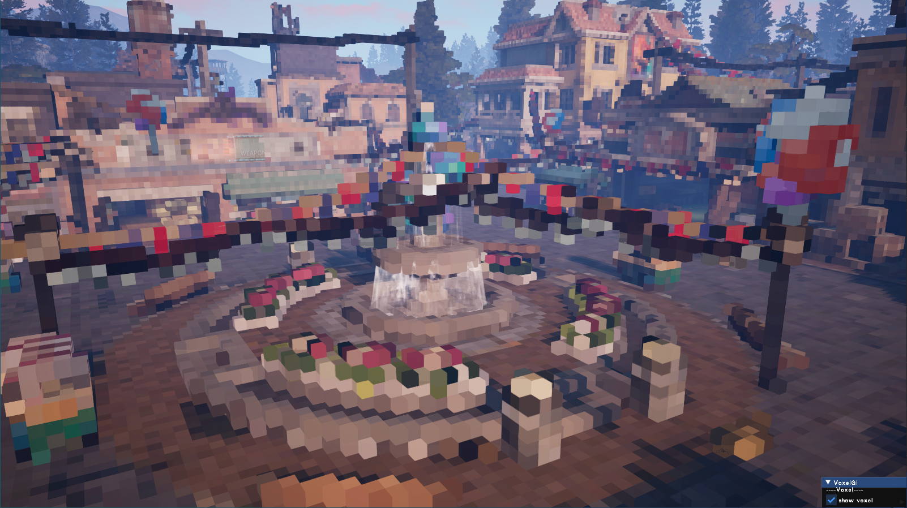
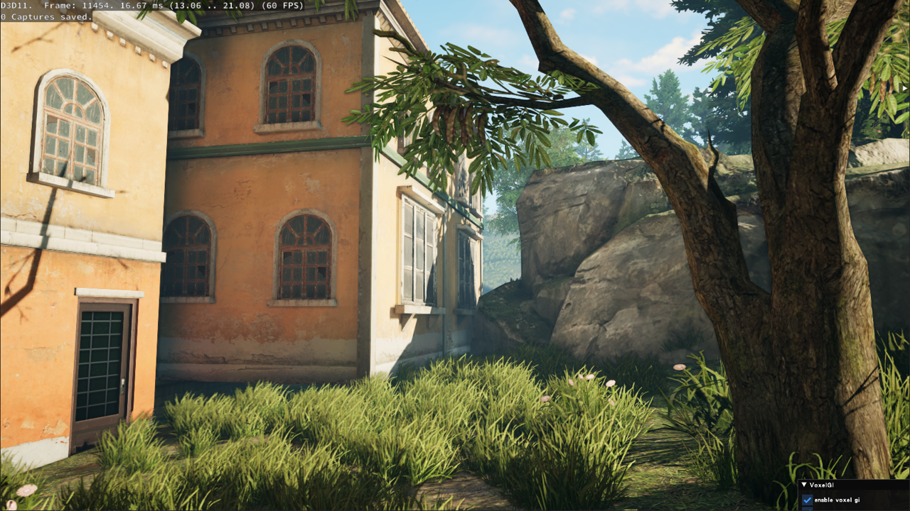
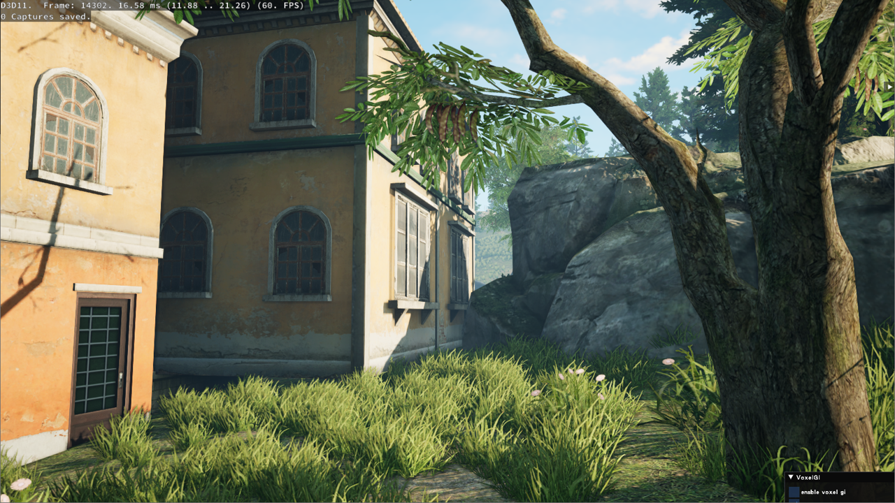
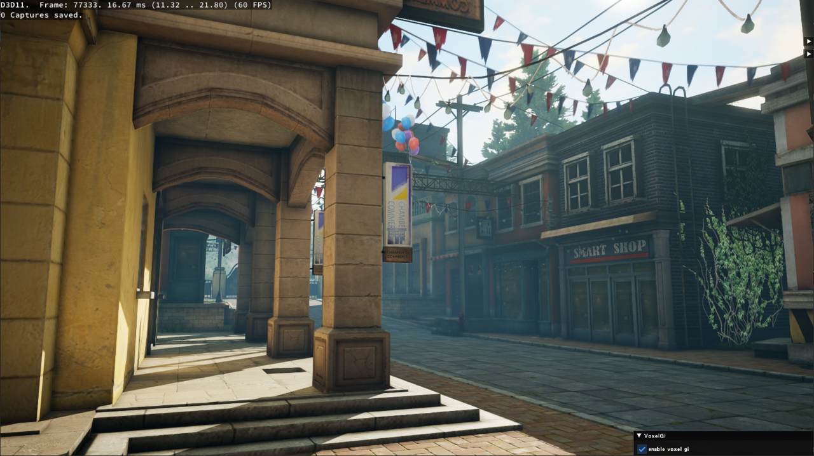
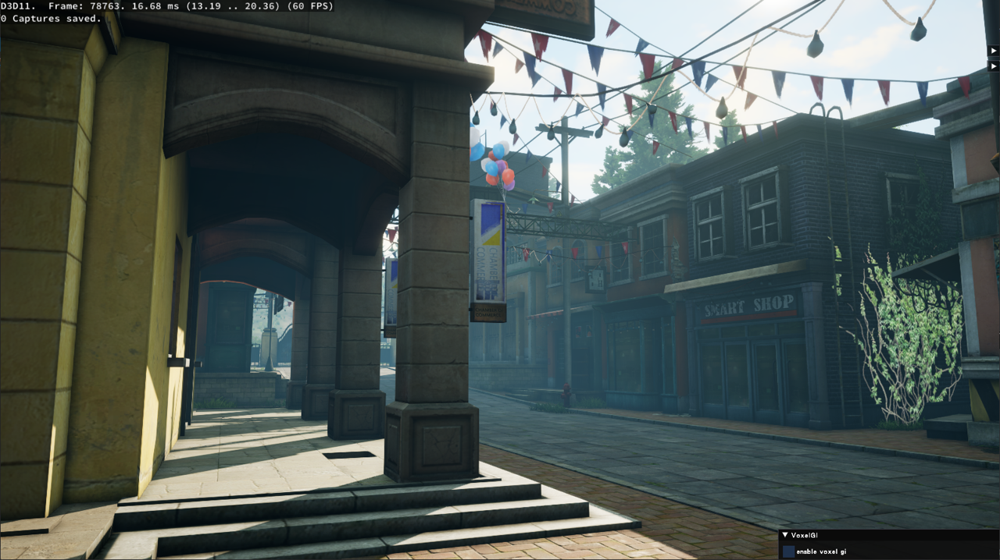

# RealTime_Voxel_DDGI
基于ScreenSpace的Voxel DDGI方案

## 方案
* 支持Diffuse GI+Sky Visibility
* 支持纯动态光照和场景，无需烘焙
* 多平台支持可在PC和Mobile流畅运行
* 效率高，2060 0.3ms，iPhone14P 1ms
* 效果稳定，已上线明日之后PC版，后续上移动版

### 场景体素化

### Probe自动生成

## 对比

### GI ON

### GI OFF

### GI ON

### GI OFF

### GI ON

### GI OFF

## TODO
* 支持屏幕外体素化
* 尝试结合Surfel GI提升细节品质